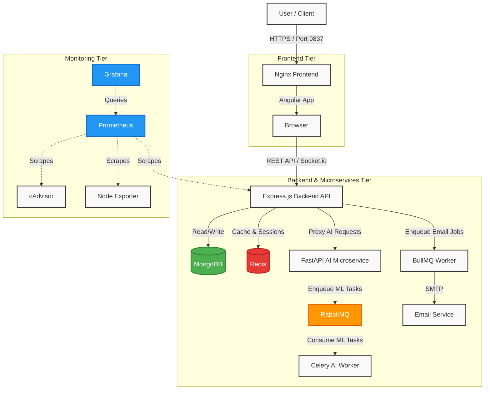

<div align="center">
  
  
  
  
  
  <h1>Lure E-Commerce 🚀</h1>
  
  <p><strong>A modern, microservices-based MERN e-commerce application featuring a world-class UI, interactive AI Chatbot, advanced analytics, and robust background task processing.</strong></p>
</div>

---

## 🌟 Features

- **World-Class Frontend (Angular v21):** Premium design, smooth transitions, dark mode, 3D hover effects, and a seamlessly integrated Checkout & Cart drawer.
- **AI Chatbot Microservice:** A sleek glassmorphic bubble with an AI Chat interface powered by a dedicated Python backend (FastAPI/Transformers).
- **RESTful API Backend:** Built with Express, Node.js, and MongoDB. Handles robust authentication, products, dynamic cart & coupon logic, and stripe-integrated orders.
- **Advanced Monitoring:** Out-of-the-box infrastructure monitoring utilizing Prometheus and Grafana dashboards for server metrics (Node Exporter) and container performance (cAdvisor).
- **Background Processing:** Celery + RabbitMQ + Redis orchestrating asynchronous tasks for the AI engine.
- **Containerized Stack:** Fully orchestrated with Docker Compose for seamless 1-click deployments.

## 🛠️ Tech Stack

### Frontend
- **Framework:** Angular v21, TypeScript
- **Styling:** SCSS, Modern Design Tokens, CSS Variables

### Backend
- **Core API:** Node.js, Express, Mongoose, JWT
- **Database:** MongoDB
- **AI Microservice:** Python, FastAPI, Celery
- **Message Broker & Caching:** RabbitMQ, Redis

### DevOps & Monitoring
- **Containerization:** Docker, Docker Compose
- **Web Server:** Nginx
- **Observability:** Prometheus, Grafana, Node Exporter, cAdvisor
- **Error Tracking:** Sentry

## 🏛️ System Architecture



## 🚀 Getting Started

The recommended way to run this highly-distributed architecture is via Docker Compose.

### Prerequisites
- [Docker](https://www.docker.com/) and [Docker Compose](https://docs.docker.com/compose/)

### Running with Docker

1. **Clone the repository:**
   ```bash
   git clone https://github.com/your-username/lure-ecommerce.git
   cd lure-ecommerce
   ```

2. **Configure Environment Variables:**
   Rename `.env.example` to `.env` in both the root, `backend/`, and `AI/` directories and populate them with your secrets (like Stripe API keys, MongoDB URLs, etc.).

3. **Spin up the Cluster:**
   ```bash
   docker compose up --build -d
   ```
   This command orchestrates:
   - `lure_mongodb`: Database
   - `lure_redis` & `lure_rabbitmq`: Message broker for Celery
   - `lure_backend`: Main Node.js API (Port `5000`)
   - `lure_ai` & `lure_celery_worker`: Python Microservices (Port `8000`)
   - `lure_frontend`: Nginx serving Angular (Port `9837`)
   - Monitoring Stack: Prometheus (`9090`), Grafana (`3000`), cAdvisor (`8080`), Node Exporter (`9100`)

4. **Access the Application:**
   - **Storefront:** [http://localhost:9837](http://localhost:9837)
   - **Grafana Dashboards:** [http://localhost:3000](http://localhost:3000) (Default Login: `admin`/`admin`)

## 🗄️ Project Structure

```text
├── AI/                 # Python FastAPI Microservice, Celery Tasks
├── backend/            # Express REST API, Models, Controllers
├── frontend/           # Angular Web App, SCSS Tokens, UI Components
├── monitoring/         # Prometheus & Grafana Provisioning configs
├── docker-compose.yml  # Microservices orchestration
└── README.md
```

## 🤝 Contributing

Contributions, issues, and feature requests are highly welcome! Feel free to check the issues page.

## 📝 License

This project is licensed under the MIT License.
